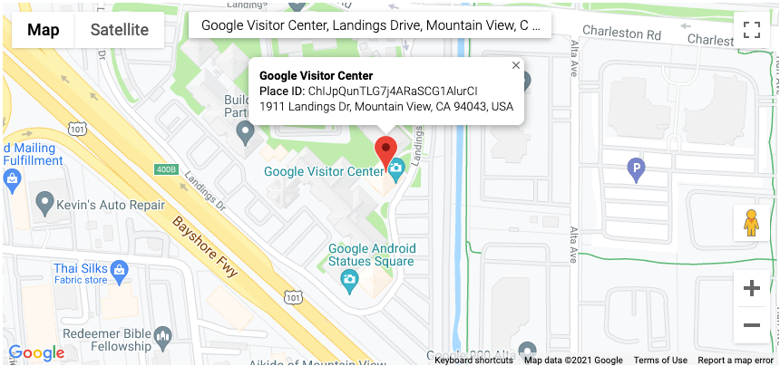

# Google Business Reviews

Google Business Reviews ruby gem uses Google Places API to fetch review for a particular location by using place_id.

## Requirements

### Obtain Google API Key
1. Open Google Developers console.
2. Create a project dedicated to your application.
3. Enable Places API nested in Google Maps API.
4. Create or attach a billing account to your project.
5. Generate and save the API key.

### Obtain Place ID
1. Visit the [link](https://developers.google.com/maps/documentation/places/web-service/place-id) and search for your location.
2. Copy the place_id as shown in the image below.
   
3. Examples:
   1. `ChIJpQunTLG7j4ARaSCG1AlurCI`
   2. `ChIJgUbEo8cfqokR5lP9_Wh_DaM`
   3. `GhIJQWDl0CIeQUARxks3icF8U8A`

## Installation

Add this line to your application's Gemfile:

```ruby
gem 'google-business-reviews'
```

And then execute:

    $ bundle install

Or install it yourself as:

    $ gem install google-business-reviews

## Usage
Simply include the module, add the Google API Key as environment variable for security reasons and fetch reviews by passing the `place_id`.
```ruby
class Business < ApplicationRecord
   include Google::Business::Reviews
   
   def reviews
      get_business_reviews(ENV["GOOGLE_API_KEY"], self.place_id)
   end
end
```
Response is converted to RUBY objects `Review` and `Author`.
```ruby
# Google::Business::Reviews::Author
# ---------------------------------
# Attributes
# ----------
# [String] Name:    Author name
# [String] URL:     Author Google reviews profile
# [String] Avatar:  Author profile avatar url
# 
# Methods
# -------
# [JSON] as_json:   Returns a JSON object with all attributes.
# [JSON] to_s:      Returns a string with pattern "Name: #{name} Url: #{url} Avatar: #{avatar}"


# Google::Business::Reviews::Review
# ---------------------------------
# Attributes
# ----------
# [Author] Author:        Review Author
# [String] Language:      Language of the review
# [Integer] Rating:       1-5 review rating for the location
# [String] Content:       Text content of the review
# [String] Time:          Time returned as date and timestamp
# [String] Relative Time: Text time such as "a month ago"
# 
# Methods
# -------
# [JSON] as_json:   Returns a JSON object with all attributes.
# [JSON] to_s:      Returns a string with pattern "#{author.name} wrote #{content} about #{relative_time}"
```
## Development

After checking out the repo, run `bin/setup` to install dependencies. You can also run `bin/console` for an interactive prompt that will allow you to experiment.

To install this gem onto your local machine, run `bundle exec rake install`. To release a new version, update the version number in `version.rb`, and then run `bundle exec rake release`, which will create a git tag for the version, push git commits and the created tag, and push the `.gem` file to [rubygems.org](https://rubygems.org).

## Contributing

Bug reports and pull requests are welcome on GitHub at https://github.com/[USERNAME]/google-business-reviews. This project is intended to be a safe, welcoming space for collaboration, and contributors are expected to adhere to the [code of conduct](https://github.com/[USERNAME]/google-business-reviews/blob/master/CODE_OF_CONDUCT.md).

## License

The gem is available as open source under the terms of the [MIT License](https://opensource.org/licenses/MIT).

## Code of Conduct

Everyone interacting in the Google::Business::Reviews project's codebases, issue trackers, chat rooms and mailing lists is expected to follow the [code of conduct](https://github.com/[USERNAME]/google-business-reviews/blob/master/CODE_OF_CONDUCT.md).
